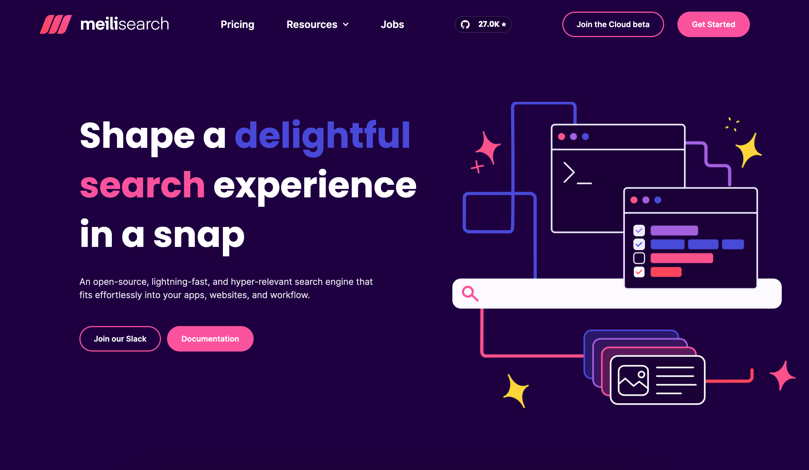

  

<h1 align="center">Landing</h1>

<h4 align="center">
  <a href="https://github.com/meilisearch/meilisearch">Meilisearch</a> |
  <a href="https://docs.meilisearch.com">Documentation</a> |
  <a href="https://slack.meilisearch.com">Slack</a> |
  <a href="https://www.meilisearch.com">Website</a> |
  <a href="https://docs.meilisearch.com/faq">FAQ</a>
</h4>
 

  

 

  

 

👋 Hi! Welcome on Meilisearch's landing repository.

Our landing is available at this address: [https://www.meilisearch.com](https://www.meilisearch.com).

If you find any bug on it, this is the right place to [open an issue](https://github.com/meilisearch/landing/issues/new) (make sure you have read our [contributing guidelines](./CONTRIBUTING.md) first). Thanks! 🙏

## 🔎 Meilisearch

Our main repository is [Meilisearch](https://github.com/meilisearch/meilisearch).

You can learn more about Meilisearch and its features in our [documentation](https://docs.meilisearch.com).

## 📚 Documentation

Our [documentation website](https://docs.meilisearch.com) is hosted in a [public GitHub repository](https://github.com/meilisearch/documentation).

## 🤝 Contributing

Hey! We're glad you're thinking about contributing to Meilisearch! Feel free to pick an [issue labeled as `good first issue`](https://github.com/meilisearch/landing/issues?q=is%3Aissue+is%3Aopen+label%3A%22good+first+issue%22), and to ask any question you need. Some points might not be clear and we are available to help you!

Also, we recommend following the [CONTRIBUTING](./CONTRIBUTING.md) to create your PR.

## 💌 Contact

You want to get in touch with us? [Discover how](https://docs.meilisearch.com/learn/what_is_meilisearch/contact.html#contact-us).

## We are hiring! 🌍

You can check the open positions on [this page](https://jobs.lever.co/meili).
